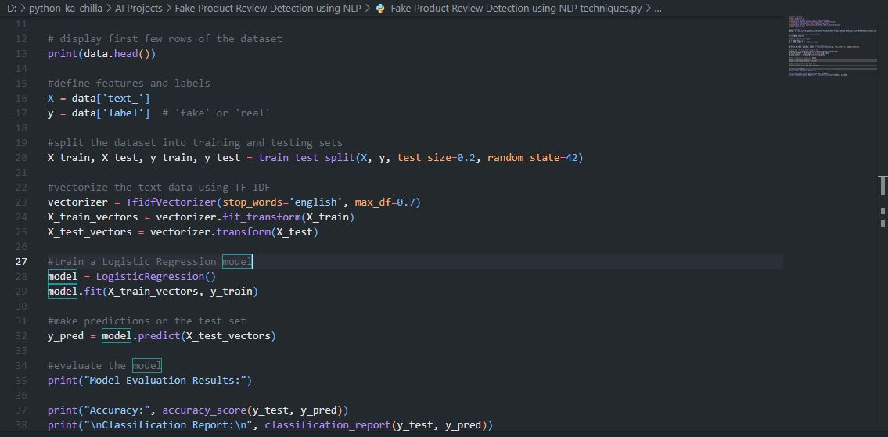
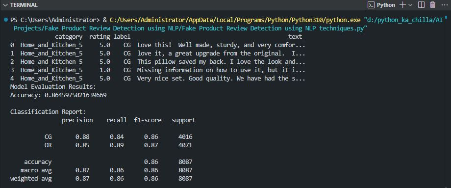

# 🕵️ Fake Product Review Detection using NLP 🤖  
     

<p align="center">  </p>

🚀 This project builds a **machine learning model** to detect fake product reviews using **Natural Language Processing (NLP)** techniques. It uses **TF-IDF vectorization** to convert text into numerical features and trains a **Logistic Regression** classifier to distinguish between genuine and deceptive reviews. The dataset contains product reviews labeled as fake or real.

---

## ✨ Key Features  
📝 **Text Preprocessing** – Cleans and prepares review text for analysis  
🔤 **TF-IDF Vectorization** – Converts text to numerical features  
🧠 **Logistic Regression** – Simple yet effective classification algorithm  
📊 **Model Evaluation** – Accuracy and detailed classification report  
📚 **Real Dataset** – Uses a labeled dataset of product reviews  
🔍 **Fake Review Detection** – Identifies deceptive reviews with high accuracy  

---

## 🧠 Tech Stack  
- **Language:** Python 🐍  
- **Libraries:** pandas, scikit-learn, numpy  
- **NLP Techniques:** TF-IDF Vectorization  
- **Model:** Logistic Regression  
- **Evaluation:** Accuracy, Precision, Recall, F1-Score  

---

## 📦 Installation  

```bash
git clone https://github.com/SayabArshad/Fake-Review-Detection-NLP.git
cd Fake-Review-Detection-NLP
pip install pandas scikit-learn numpy
````

⚙️ Note: The dataset fake reviews dataset.csv is included in the repository.

---

## ▶️ Usage

Run the main script:

```bash
python "Fake Product Review Detection using NLP techniques.py"
```

The script will:

Load the dataset.

Split data into training and testing sets.

Vectorize text using TF-IDF.

Train a Logistic Regression model.

Print accuracy and classification report.

---

## 📁 Project Structure

```
Fake-Review-Detection-NLP/
│-- Fake Product Review Detection using NLP techniques.py   
│-- fake reviews dataset.csv                                 
│-- README.md                                                
│-- assets/                                                  
│    ├── code.JPG
│    └── output.JPG
```
---

## 🖼️ Interface Previews

| 📝 Code Snippet | 📊 Console Output |
|:---------------:|:-----------------:|
|  |  |

---

## 💡 About the Project

Fake product reviews are a growing problem on e-commerce platforms, misleading customers and damaging trust. This project demonstrates how Natural Language Processing can help identify deceptive reviews. Using a dataset of labeled reviews, the pipeline applies TF-IDF vectorization to convert text into numerical features, then trains a Logistic Regression classifier. The model learns patterns that distinguish fake reviews from genuine ones. This approach can be extended to larger datasets and more sophisticated models like neural networks for production-level fake review detection.

---

## 🧑‍💻 Author

Developed by: Sayab Arshad Soduzai 👨‍💻
📅 Version: 1.0.0
📜 License: MIT License

---

## ⭐ Contributions

Contributions are welcome! Fork the repository, open issues, or submit pull requests to enhance functionality (e.g., adding more preprocessing, trying different classifiers, or building a web interface).
If you find this project helpful, please ⭐ star the repository to show your support.

---

📧 Contact
For queries, collaborations, or feedback, reach out at sayabarshad789@gmail.com

---

🕵️ Unmasking fake reviews, one review at a time.

---
